# Introduction

PyPacian (Python Packet Technician) is a packet capturing, editing, and sending tool for Python.
PyPacian capture packets from NIC and transfer other PC.

## System Overview




## System

- Set pypacian.cfg
    1. Mode E: construct connection each time
    1. Mode K: keep connection 
1. Mode E:
    1. PyPacian monitor each packet which are got from source NIC.
    1. PyPacian make socket which connect target PC and transfer every packet when packet match filter.
1. Mode K:
    1. PyPacian make socket which connect target PC.
    1. PyPacian monitor each packet which are got from source NIC.
    1. PyPacian transfer every packet when packet match filter.

## Installation
TBD

## How to Use
TBD

```text
$ git clone https://github.com/montblanc18/persephonep.git
$ cd persephonep
$ python -m venv .venv
$ source venv/bin/activate
$ pip install -U pip
$ pip install -e . -r requirements.txt
```